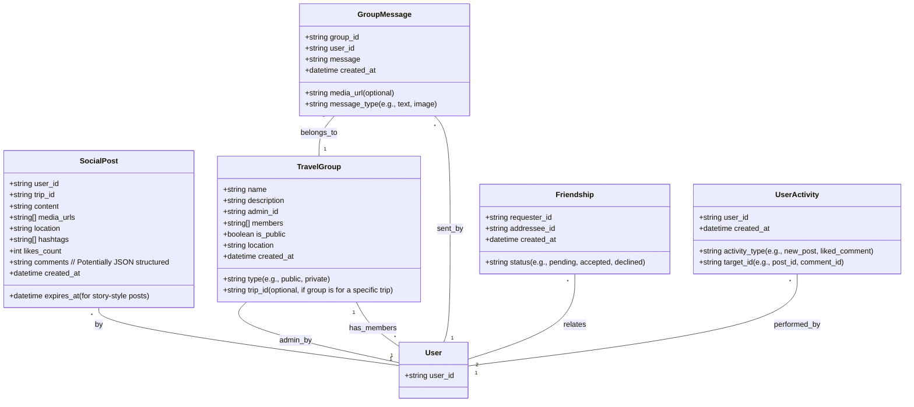
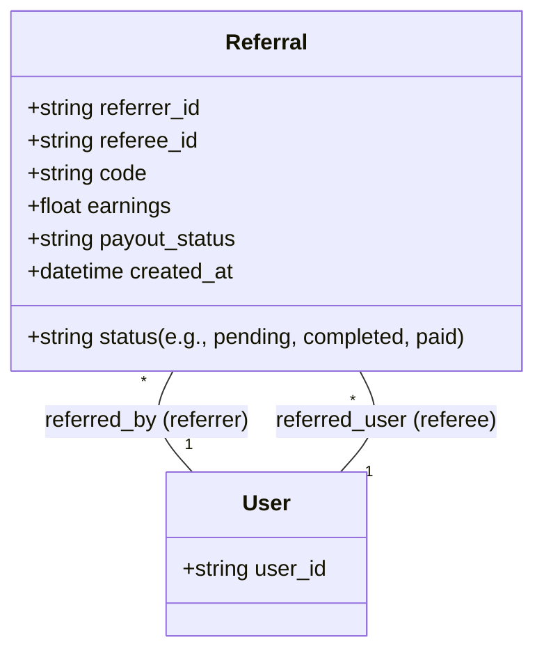
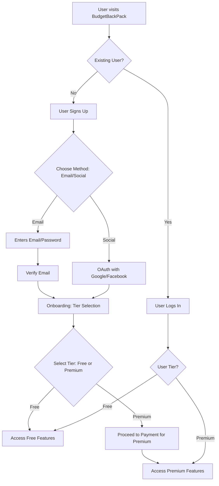
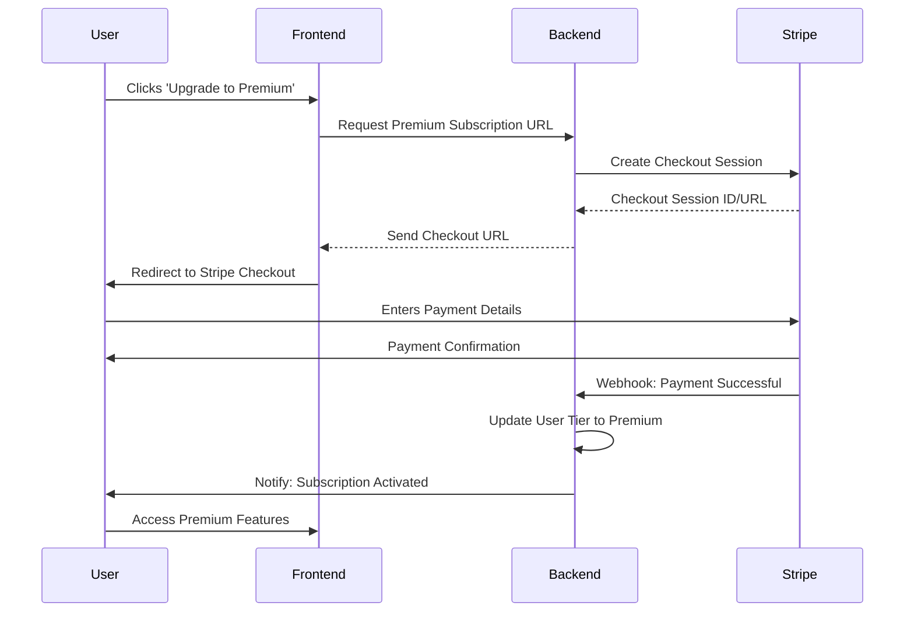

# BudgetBackPack Overview

## 1. Introduction

**Welcome to BudgetBackPack!** This document provides a comprehensive overview of the BudgetBackPack project, encompassing its product goals, software architecture, and developer-relevant information. It is intended to serve as a central reference point for understanding the various facets of the project.

### 1.1. Product Vision

BudgetBackPack aims to be the world's pioneering **Social Travel Platform**. It uniquely merges social media engagement with budget-conscious travel planning, effectively carving out a new market segment termed "Social Travel."

### 1.2. Mission Statement

Our mission is to **democratize travel through community**. We strive to make affordable adventures accessible, social, and rewarding, especially for the digital-native generation.

### 1.3. Purpose of this Document

This overview consolidates information from product management, software architecture, and developer perspectives to:
- Provide a high-level understanding of the project.
- Document key architectural decisions and components.
- Offer a starting point for developers to understand the codebase and its structure.
- Facilitate communication and alignment across different stakeholders.

This document will leverage information primarily from the existing Product Requirements Document (`projectGuide/BudgetBackPack_Analysis.md`) and will be updated as the project evolves.

## 2. Product Manager Perspective

This section outlines the product strategy, target users, and feature roadmap from a product management standpoint, based on the Product Requirements Document (PRD).

### 2.1. Core Value Propositions

BudgetBackPack offers distinct advantages for different user tiers:

**For Free Users:**
- Comprehensive trip planning tools.
- Budget-friendly search results.
- Access to community-generated content.
- Basic social discovery.

**For Premium Users ($9.99/month):**
- Full social travel experience.
- Unlimited searches and bookings.
- Group planning and collaboration tools.
- Referral earnings program.
- Exclusive deals and priority support.

### 2.2. Key User Personas

The platform is designed with the following primary user archetypes in mind:

1.  **"Social Nomad Sarah" (25):**
    *   A remote-working Social Media Manager who travels frequently (4-6 trips/year).
    *   Values sharing experiences, finding travel buddies, and saving money.
    *   Highly active on social media (Instagram, TikTok) and values authenticity.
    *   Pain Points: Expensive travel, planning complexity, solo travel safety.

2.  **"Budget Explorer Mike" (22):**
    *   A recent graduate and freelance developer.
    *   Travels 2-3 times a year on a limited budget.
    *   Seeks to maximize experiences per dollar and learn from a community.
    *   Active on Reddit and YouTube.
    *   Pain Points: Limited budget, lack of travel experience.

3.  **"Group Organizer Emma" (28):**
    *   A Marketing Manager who organizes 3-4 group trips annually.
    *   Needs tools to streamline group planning and cost splitting.
    *   Aims to ensure everyone in the group has a good time.
    *   Often an admin for WhatsApp groups and an event organizer.
    *   Pain Points: Coordinating group travel, splitting costs.

### 2.3. Phased Feature Rollout

The development is planned in distinct phases:

1.  **Phase 1: Launch MVP (Target: Days 1-10)**
    *   Focus: Essential features for user functionality and initial monetization.
    *   Key Features: Enhanced User Authentication, Premium Subscription System, Google Places Image Integration, Enhanced Trip Planning Dashboard, Referral System Foundation.

2.  **Phase 2: Social Features (Target: Days 11-30)**
    *   Focus: Building the core "Social Travel" experience.
    *   Key Features: Travel Social Feed ("TravelStream"), Travel Groups & Communities, Friend System & Social Discovery.

3.  **Phase 3: Advanced Social Features (Target: Days 31-60)**
    *   Focus: Enhancing engagement and utility with sophisticated social tools.
    *   Key Features: Travel Buddy Matching, Gamification & Rewards, Live Travel Features.

*(For detailed feature specifications, user stories, and acceptance criteria, please refer to the full PRD in `projectGuide/BudgetBackPack_Analysis.md`.)*

## 3. Software Architect Perspective

This section delves into the technical architecture of BudgetBackPack, including database design, API structure, key user flows, and infrastructure components, as envisioned in the PRD.

*[Further details and refinements will be added as the codebase within the submodules (`Budget-BackPack-BackEnd-Server` and `Budget-BackPack-FrontEnd-Server`) is explored.]*

### 3.1. Database Schema

The following diagrams illustrate the structure of the new database models planned for implementing the social and referral features.

#### 3.1.1. Social Features Models



#### 3.1.2. Referral System Model


*(Note: Existing models like User, Trip, etc., are assumed and will be detailed further based on actual backend implementation.)*

### 3.2. API Structure

The backend will expose a RESTful API. Key endpoint categories identified in the PRD include:

*   **/api/social/**: For creating posts, fetching feeds, likes, comments.
    *   `POST /api/social/posts`
    *   `GET /api/social/feed`
    *   `POST /api/social/posts/:id/like`
    *   `POST /api/social/posts/:id/comment`
*   **/api/groups/**: For group creation, discovery, joining, and messaging.
    *   `POST /api/groups/create`
    *   `GET /api/groups/discover`
    *   `POST /api/groups/:id/join`
    *   `GET /api/groups/:id/messages`
    *   `POST /api/groups/:id/messages`
*   **/api/friends/**: For managing friend requests and suggestions.
    *   `POST /api/friends/request`
    *   `PUT /api/friends/:id/accept`
    *   `GET /api/friends/suggestions`
*   **/api/referrals/**: For referral statistics and payouts.
    *   `GET /api/referrals/stats`
    *   `POST /api/referrals/payout`

*(A more detailed API component diagram can be added here later, illustrating interactions between frontend, backend, database, and external services.)*

### 3.3. Key User Flows

The following diagrams illustrate some of the critical user flows.

#### 3.3.1. User Authentication and Tier Selection



#### 3.3.2. Premium Subscription Flow



#### 3.3.3. Basic Social Post Creation and Feed Display

```mermaid
flowchart TD
    subgraph Post Creation
        P1[User (Premium) navigates to 'Create Post']
        P2[Uploads Photo/Video]
        P3[Adds Caption, Location, Hashtags]
        P4[Clicks 'Post'] --> P5{API Request: POST /api/social/posts}
    end
    subgraph Feed Display
        F1[Another User opens App/Website] --> F2{API Request: GET /api/social/feed}
        F2 --> F3[Backend retrieves posts based on algorithm]
        F3 --> F4[Posts, including new post by Premium User, displayed in feed]
    end
    P5 --> F3
```

### 3.4. Infrastructure Highlights

The PRD outlines the following key infrastructure components:

*   **Media Storage:**
    *   AWS S3 or Cloudinary for image/video storage.
    *   CDN for global content delivery.
    *   Image processing pipeline for optimization.
*   **Real-time Features:**
    *   Socket.io for real-time chat and notifications.
    *   Redis for session management and caching.
    *   WebRTC for potential live streaming capabilities.
*   **Payment Processing:**
    *   Stripe for subscription management.
    *   PayPal integration for referral payouts.
    *   Webhook handling for payment events.

*(Specific choices and configurations will be detailed based on the actual implementation in the backend.)*

## 4. Developer Perspective

This section provides information relevant to developers working on the BudgetBackPack project.

### 4.1. Codebase Structure

The project is organized into a multi-repository setup, likely utilizing Git submodules for distinct components:

*   **`Budget-BackPack-BackEnd-Server/`**: This directory contains or will contain the backend server code.
    *   *[Detailed documentation on the backend's internal structure, key modules, specific technologies used (e.g., Node.js framework, database ORM), and setup instructions should be added here once the submodule's contents are fully accessible and reviewed.]*
*   **`Budget-BackPack-FrontEnd-Server/`**: This directory contains or will contain the frontend application code (e.g., React, Angular, Vue).
    *   *[Detailed documentation on the frontend's architecture (e.g., component structure, state management), key libraries, build processes, and setup instructions should be added here once the submodule's contents are fully accessible and reviewed.]*
*   **`BudgetBackPack.code-workspace`**: This VS Code workspace file is configured to help manage the multi-root project structure, allowing developers to work on both frontend and backend simultaneously within a single VS Code instance.

### 4.2. Development Environment Setup

A shell script `setup-dev.sh` is present in the root of the main repository.
*   **`setup-dev.sh`**:
    *   The purpose of this script is presumed to be for initializing the development environment, which might include tasks like installing dependencies for the main project or the submodules, and potentially setting up any necessary Git hooks or local configuration.
    *   *[Specific steps performed by this script should be documented here after its contents are reviewed.]*

### 4.3. Getting Started (Placeholders)

*[This subsection will be expanded with more specific instructions.]*

*   **Prerequisites:**
    *   *[List necessary software, e.g., Node.js version, Docker, specific IDEs or extensions.]*
*   **Cloning the Repository:**
    *   `git clone --recurse-submodules <repository-url>` (Example command if submodules are used)
*   **Running the Application:**
    *   *[Instructions for starting the backend server.]*
    *   *[Instructions for starting the frontend development server.]*
*   **Running Tests:**
    *   *[Commands for executing backend unit/integration tests.]*
    *   *[Commands for executing frontend tests.]*

### 4.4. Contribution Guidelines

*[This subsection will outline guidelines for contributing to the project, including:]*
*   *Branching strategy (e.g., Gitflow).*
*   *Code style and linting requirements.*
*   *Commit message conventions.*
*   *Pull request process.*
*   *Code review expectations.*

**(Note: The `projectGuide/AI-readme.md` file contains information regarding interaction with GitHub issues via the API, which might be relevant for automation or integration tasks.)**
